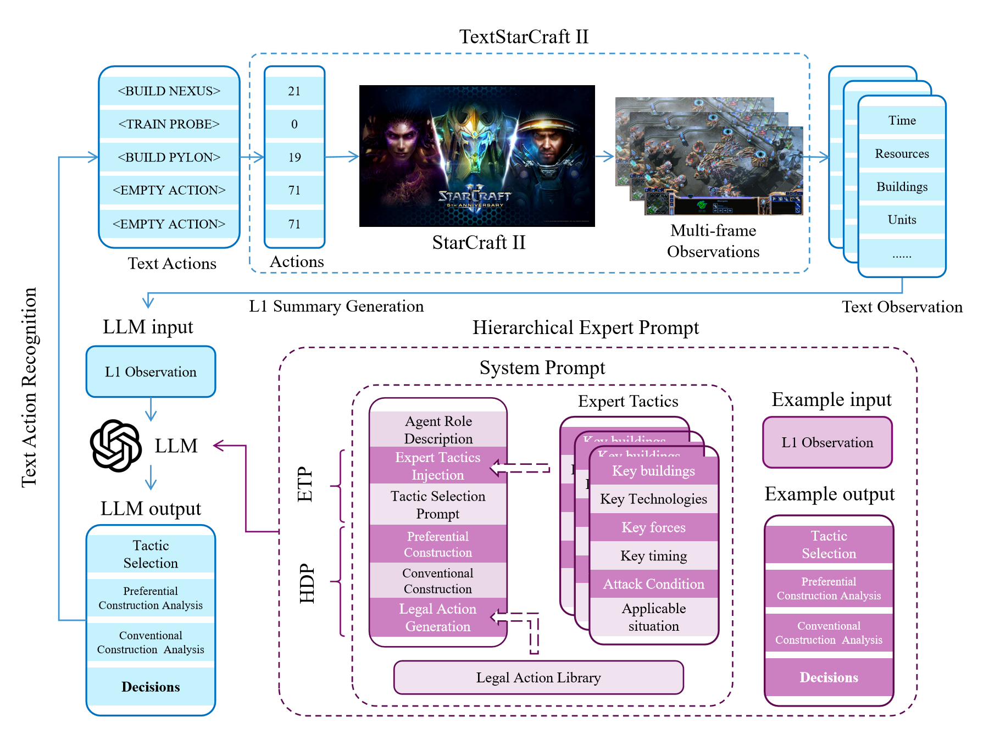

# Hierarchical Expert Prompt for Large-Language-Models: An Approch Defeat Elite AI in TextStarCraft-II for the First Time

2024/6/16 Zongyuan Li, Chang Lu, et. al.

College of Artificial Intelligence, Nankai University, Tianjing, China + Laboratory for Big Data and Decision, National University of Defense Technology, Changsha, China

 
paper: Our paper is currently under review and is expected to be published soon. You can contact us by emailing 2120230524@mail.nankai.edu.cn or 734162621@qq.com.

## Quick Start

1. Install TextStarCraft II

Download the repository:
https://github.com/histmeisah/Large-Language-Models-play-StarCraftII/tree/e34e1f3d605f30000a75527c93908f4588175008
, follow the instruction in their README to install TextStarCraft II.

2. Build HEP-Agent

2.1. Replace YOUR_PATH\Large-Language-Models-play-StarCraftII-main\sc2_rl_agent\starcraftenv_test\prompt\prompt.py
with prompt.py in our repository. 

2.2 Replace YOUR_PATH\Large-Language-Models-play-StarCraftII-main\sc2_rl_agent\starcraftenv_test\worker.py
with worker.py in our repository.

3. Test the HEP-Agent

Run a demo according to the baseline repository README, make sure the target worker of multiprocess.process is the 
redefined 'def chatgpt_worker', and the sc2prompt in chatgpt_worker is our 'class StarCraftII_HEP'. replay
video can be viewed on https://www.bilibili.com/video/BV1uz42187EF and https://youtu.be/dO3PshWLV5M.

## Results

### Comparison on different decision-making methods

|  Work        |         AlphaStar     | SCC          | HierNet-SC2         |AlphaStar Unplugged |  ROA-Star| Baseline(CoS)      | Ours                       |
|-----------------------|--------------|-----------------|---------------------|---------------|-------------|--------------------|----------------------------|
|Method                 |SL+RL+self-play  | SL+RL+self-play  | data-mining + RL|offline RL |  SL+RL+self-play   | prompt + Rule base script | prompt + Rule base script  | 
| Compute resource      | 12000 CPU cores, 384 TPUs| Linear     | 4 GPUs,48 CPU cores|not clear|2x 64 v100 | 1 gpu,1 cpu(home computer) | 1 gpu,1 cpu(home computer) |
|Required replay        |971,000 | 4,638     |608|20,000,000(20m)| 120938 | 0                  | 0                          |
|Best result(The greatest opponent ever to win)|Serral(One of the best progamer in the world)|Time(IEM2023 Champion)|build-in ai lv-10|AlphaStar BC agent|hero(GSL Champion)| build-in ai lv-5   | build-in ai lv-7           |
|Strategy Interpretability|&#x2716;|&#x2716;|&#x2716;|&#x2716;|&#x2716;| &#x2714;           | &#x2714;                            |
|Expansibility(adapt to latest game version and other race ) |&#x2716;|&#x2716;|&#x2716;|&#x2716;|&#x2716;| &#x2714;           | &#x2714;                            |

### Win Rate Comparison of LLM Agents Against TextStarCraft II's Built-in AI

| Prompt            | LV1 | LV2  | LV3  | LV4   | LV5  | LV6  | LV7  |
|-------------------|-----|------|------|-------|------|------|------|
| Baseline(Prompt1) | 7/8 | 6/9  | 2/8  | 1/8   | 0/8  | 0/8  | TBD  |
| Baseline(Prompt2) | 8/8 | 9/9  | 8/8  | 21/25 | 7/14 | 0/12 | TBD  |
| Ours              | TBD | TBD  | TBD  | 12/12 | 9/12 | 9/12 | 3/12 |

## Cite

Our paper is currently under review and is expected to be published soon. Some part of our codes is temporarily locked, to protect our result until paper be published. You can contact us by emailing 734162621@qq.com temporarily.
